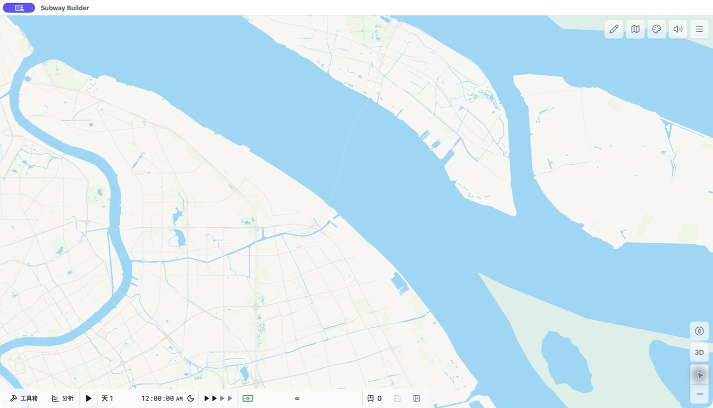
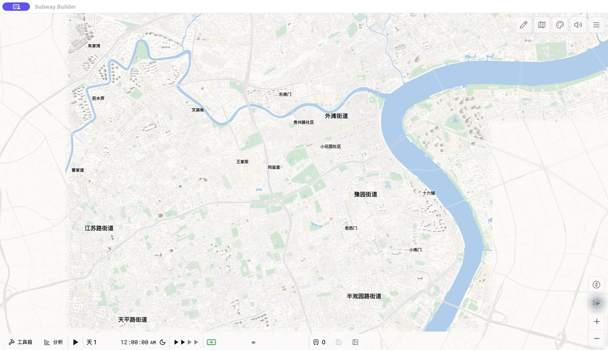
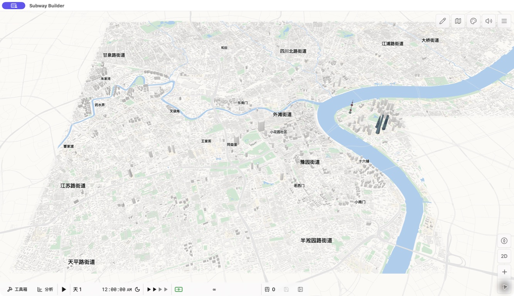
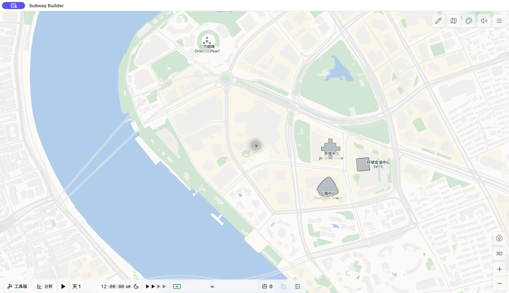
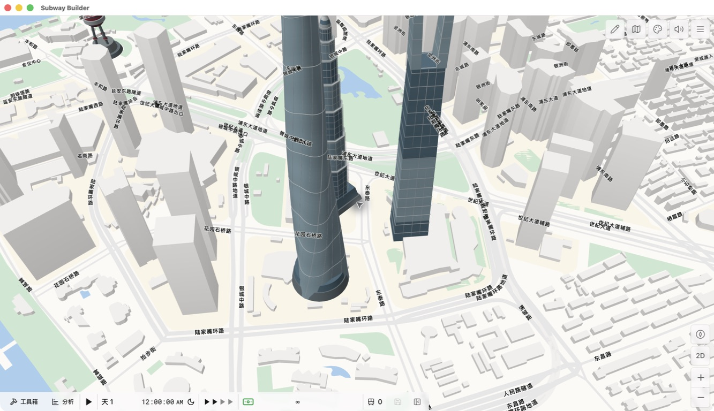

# 上海 (Shànghǎi) — PVG

## 最新开发进展 / Latest development · 2026-10-01

**Shanghai Operations / 上海多制式运营 `0.8.1-dev.2` — 开发源码预览。**

本仓库主分支包含最新运营模组源码、具体版本差异与脱敏测试证据。**地图正式发布包仍为 v2.1.0**；更新源码不等于新版已通过 Railyard 审核或已在 Library 上架。

The latest operations source preview is included in this repository. The published map ZIP remains **v2.1.0**. This source update is **not** a stable mod release or Railyard approval.

- [最新源码与使用限制 / Latest source and limitations](operations-preview/0.8.1-dev.2/)
- [与现有上海地图及相关模组的具体区别 / Concrete community comparison](operations-preview/0.8.1-dev.2/COMMUNITY_COMPARISON_2026-10-01.md)
- [脱敏专项测试证据 / Sanitized targeted QA](operations-preview/0.8.1-dev.2/review-evidence/r16-summary.json)
- [发布前验收状态与 10 月 3 日离线复验 / Acceptance status and October 3 offline reverification](operations-preview/0.8.1-dev.2/review-evidence/ACCEPTANCE_STATUS_2026-10-03.md)
- [社区预审请求 / Community review-guidance request](https://github.com/Subway-Builder-Modded/registry/pull/9355#issuecomment-5930567389)

### 新增运营能力 / Operations scope

- 线路优先的停站、地图与配车预览；通过原生寻路应用为独立新服务，并按方案归属撤销。
- 普通 / 快车 / 急行可与兼容的直通运营组合；五档轨道及车辆为 80 / 120 / 160 / 200 / 300 km/h。
- 基于真实基础设施的自动站型规划，以及 2 / 4 / 6 / 8 股道模板开发接口；缺少股道时明确提示待改造。
- 新接轨与动态越行安全修复：真实通过线入口判定、原生批次兼容、完整车尾清空及整列车长＋25 m 的出口保护。

Native targeted testing on **Subway Builder 1.7.2** advanced **7,368 simulated seconds** on a **43-route / 228-original-train** save with 8 new native trains. **3 of 5 holds** independently verified actual slow departure after fast-tail clearance; the other 2 lack sufficient continuous proof and are not counted as successful overtakes. The two previously failing T1 trains had no timeout removals during that test. This does **not** certify full-day operation or arbitrary-scale performance.

**开发限制 / Development limits:** `publishReady=false`；高级自动接轨、动态越行及可选离站保护尚未默认启用，普通玩家启用流程和长周期/完整载客周转验收仍待完成。当前仅支持 PVG，不宣称兼容社区已有的 SHA 地图。最新预建需求线网存档不在此源码预览中。

**数据质量说明 / Map-quality clarification:** 就业居民、细类型标定和双约束合成 O/D 已属于原 v2.1.0 的方法证据，不是本次新增实测数据。原地图 PR 已因缺少对现有上海地图的数据质量改进而被拒；运营玩法不替代地图数据质量要求。下方为历史已发布地图资料，计算评级不是维护者确认评级。

---

A high-detail bilingual Shanghai map for **Subway Builder** and **Railyard**, authored by **LeoVan**.

由 **LeoVan** 制作的上海高精度双语地图，适用于 **Subway Builder** 与 **Railyard**。

## Published map download / 已发布地图下载 · v2.1.0

- [Shanghai-PVG-v2.1.0.zip](https://github.com/LeoVan1412/shanghai-pvg/releases/latest/download/Shanghai-PVG-v2.1.0.zip)
- [manifest.json](https://github.com/LeoVan1412/shanghai-pvg/releases/latest/download/manifest.json)
- [Latest release notes / 最新发布说明](https://github.com/LeoVan1412/shanghai-pvg/releases/latest)

Map ZIP SHA-256: `3bb2dbec2b650a92eed5814197757f3930062215c63cc843cb620946884345b4`

## Highlights / 主要特性

- Complete coverage of all 16 Shanghai districts, with geographic-only context in surrounding Jiangsu and Zhejiang.
- Real roads, water, land use, administrative boundaries, place labels, buildings, foundations, and collision data.
- 13,001,675 official-census-derived employed residents, closed exactly across all 16 districts and 225 street/town areas.
- 15,243,400 modeled people across 15,050 non-phantom demand points and 76,217 fixed 200-person groups.
- 100% precomputed coverage for all 73,904 unique origin/destination pairs.
- Doubly constrained workplace O/D with zero origin/destination margin error; mean routed commute 10.3965 km against the official 10.2 km.
- Complete 220-component sensitive-area redaction across map geometry, facilities, demand, paths, and collision data, with automatic zero-overlap tests.
- A separately packaged 2030 stress builder covers 36 services, detailed operating alignments, the shared Line 3/4 corridor, regional rail, and a non-linear Maglev route.
- Hybrid building allocation with locally calibrated residential and workplace fine types; historical illustrative score 0.6475875 is **not a maintainer-confirmed rating**. The last questionnaire result was self-reported Medium; the previous map submission was declined.
- People-only demand: freight tonnage, container throughput, and agricultural output are never converted into passengers.
- Source and license records are included in the map package; visible attribution is preserved below.

- 覆盖上海全部 16 个区，江苏、浙江周边区域仅作为地理背景，不生成客流。
- 包含真实道路、水体、土地利用、行政边界、地名、建筑、地基与碰撞数据。
- 新增从官方人口普查推导的 13,001,675 名就业居民，并在 16 区、225 个街镇空间单元精确闭合。
- 模拟 15,243,400 人、15,050 个非空需求点及 76,217 个固定 200 人出行组。
- 全部 73,904 个唯一 O/D 组合均已预计算道路路径。
- 就业通勤采用双约束 O/D，起终点边际误差均为 0；道路平均距离 10.3965 公里，对应官方 10.2 公里。
- 对 220 个完整敏感区域组件执行地图几何、设施、需求、路径及碰撞数据的全层面脱敏，并加入零重叠自动测试。
- 2030 线网压力测试构建器独立打包，覆盖 36 条服务、现状线路详细走向、3/4 号线共线、市域线路及非直线磁浮走向。
- 混合来源建筑落点与本地标定的居民/岗位细分类型；历史示例计算为 0.6475875，**不代表维护者确认评级**。最近问卷结果为自报 Medium，此前地图提交已被拒。
- 只模拟人员出行；货运吨位、集装箱吞吐量及农业产量不会直接转换为乘客。

See [DESCRIPTION.md](DESCRIPTION.md) for the full bilingual description,
[DATA_SOURCES.md](DATA_SOURCES.md) for source details, and
[DATA_QUALITY_SUBMISSION.md](DATA_QUALITY_SUBMISSION.md) for the transparent
Registry scoring evidence and limitations.

## Launch requirement / 启动要求

Launch Subway Builder with Railyard's **Launch** button. PVG uses the local tile service started by Railyard. Launching the game directly from Steam can leave only cached roads visible while land, parks, and water appear white.

请始终通过 Railyard 的 **Launch** 按钮启动 Subway Builder。PVG 依赖 Railyard 同步启动的本地瓦片服务；直接从 Steam 启动可能只显示缓存道路，而陆地、绿化和水域变成白底。

## Gallery / 图库

### Yangtze estuary and islands / 长江口与岛屿

### Central Shanghai 2D / 上海中心城区 2D

### Central Shanghai 3D / 上海中心城区 3D

### Lujiazui landmark plan view / 陆家嘴地标平面图

### Lujiazui landmark detail / 陆家嘴地标细节

## Attribution and licenses / 署名与许可

Map data © OpenStreetMap contributors — ODbL 1.0. Building footprints © Overture Maps Foundation and upstream contributors — ODbL 1.0. Ocean-depth shading: GEBCO Compilation Group (2024), GEBCO 2024 Grid, doi:10.5285/1c44ce99-0a0d-5f4f-e063-7086abc0ea0f.

See [ATTRIBUTION.md](ATTRIBUTION.md), [CREDITS.md](CREDITS.md), [LICENSE](LICENSE), and [LICENSE-DATA.md](LICENSE-DATA.md).
