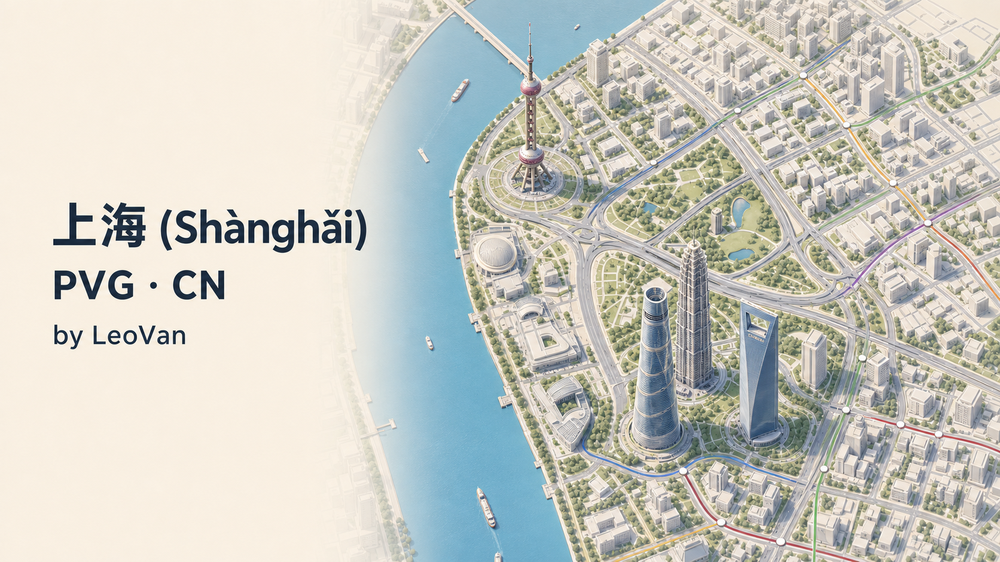

# 上海 (Shànghǎi) — PVG

A high-detail bilingual Shanghai map for **Subway Builder** and **Railyard**, authored by **LeoVan**.

由 **LeoVan** 制作的上海高精度双语地图，适用于 **Subway Builder** 与 **Railyard**。

## Download / 下载

- [Shanghai-PVG-v2.0.0.zip](https://github.com/LeoVan1412/shanghai-pvg/releases/latest/download/Shanghai-PVG-v2.0.0.zip)
- [manifest.json](https://github.com/LeoVan1412/shanghai-pvg/releases/latest/download/manifest.json)
- [Latest release notes / 最新发布说明](https://github.com/LeoVan1412/shanghai-pvg/releases/latest)

Map ZIP SHA-256: `0e44080313b45c7fd8cf51fee4ea049fb70ef9828aaf7b2bd587c6035628ae5f`

## Highlights / 主要特性

- Complete coverage of all 16 Shanghai districts, with geographic-only context in surrounding Jiangsu and Zhejiang.
- Real roads, water, land use, administrative boundaries, place labels, buildings, foundations, and collision data.
- 15,243,400 modeled people across 10,249 non-phantom demand points and 76,217 fixed 200-person groups.
- 100% precomputed coverage for all 75,156 unique origin/destination pairs.
- People-only demand: freight tonnage, container throughput, and agricultural output are never converted into passengers.
- Source and license records are included in the map package; visible attribution is preserved below.

- 覆盖上海全部 16 个区，江苏、浙江周边区域仅作为地理背景，不生成客流。
- 包含真实道路、水体、土地利用、行政边界、地名、建筑、地基与碰撞数据。
- 模拟 15,243,400 人、10,249 个非空需求点及 76,217 个固定 200 人出行组。
- 全部 75,156 个唯一 O/D 组合均已预计算道路路径。
- 只模拟人员出行；货运吨位、集装箱吞吐量及农业产量不会直接转换为乘客。

See [DESCRIPTION.md](DESCRIPTION.md) for the full bilingual description and [DATA_SOURCES.md](DATA_SOURCES.md) for source details.

## Launch requirement / 启动要求

Launch Subway Builder with Railyard's **Launch** button. PVG uses the local tile service started by Railyard. Launching the game directly from Steam can leave only cached roads visible while land, parks, and water appear white.

请始终通过 Railyard 的 **Launch** 按钮启动 Subway Builder。PVG 依赖 Railyard 同步启动的本地瓦片服务；直接从 Steam 启动可能只显示缓存道路，而陆地、绿化和水域变成白底。

## Gallery / 图库

### Yangtze estuary and islands / 长江口与岛屿

### Central Shanghai 2D / 上海中心城区 2D

### Central Shanghai 3D / 上海中心城区 3D

### Lujiazui landmark plan view / 陆家嘴地标平面图

### Lujiazui landmark detail / 陆家嘴地标细节

## Attribution and licenses / 署名与许可

Map data © OpenStreetMap contributors — ODbL 1.0. Building footprints © Overture Maps Foundation and upstream contributors — ODbL 1.0. Ocean-depth shading: GEBCO Compilation Group (2024), GEBCO 2024 Grid, doi:10.5285/1c44ce99-0a0d-5f4f-e063-7086abc0ea0f.

See [ATTRIBUTION.md](ATTRIBUTION.md), [CREDITS.md](CREDITS.md), [LICENSE](LICENSE), and [LICENSE-DATA.md](LICENSE-DATA.md).
